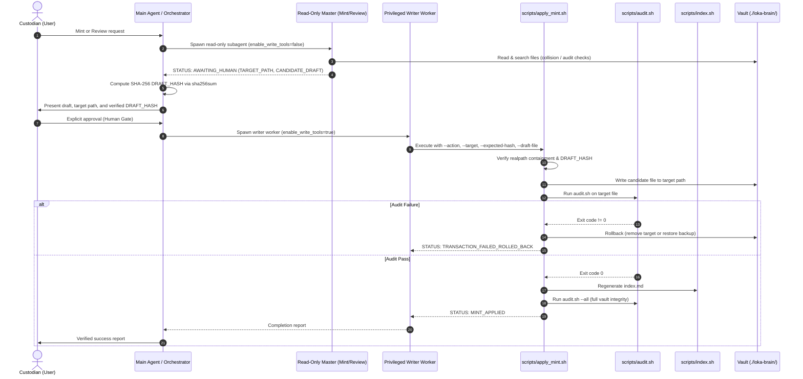

# LOKA Agent Operations & Knowledge Substrate

The `.agents` directory serves as the encapsulated operational knowledge vault and autonomous skill execution substrate for the LOKA repository. Operating under the workspace contract (`../AGENTS.md`), it decouples knowledge retention, quality governance, and workflow automation from transient host runtime environments.

## Purpose

The primary purpose of `.agents` is to provide a machine-actionable, persistent knowledge architecture paired with isolated, privilege-separated agent execution skills:

1. **LOKA Knowledge Vault (`./loka-brain/`)**: A modular, machine-actionable knowledge repository governed by `./loka-brain/AGENTS.md` and `./loka-brain/schema.md` (v0.2.2). It enforces linear lifecycle progression (`draft` → `test` → `active`), single-domain purity across six canonical domains (`profiles`, `behaviors`, `standards`, `workflows`, `tools`, `meta`), strict AST-compatible wikilinks, de-identification of host paths, and complete runtime-vault decoupling.
2. **Specialized Agent Skills (`./skills/`)**: Modular agent capabilities delegated to handle specific workspace tasks:
   - `loka` (`./skills/loka/`): Dual-master orchestrator managing the Knowledge Artifact lifecycle via read-only minting and review subagents, an interactive SHA-256 cryptographic Human Gate, and a transactional write worker with automated rollback.
   - `loka-git-manager` (`./skills/loka-git-manager/`): Local Git operations manager enforcing pre-flight checks, atomic Conventional Commits, and staged secret/debug scans without external push dependencies.
   - `loka-log` (`./skills/loka-log/`): Workspace archivist recording immutable session evidence ledgers (`session_YYYY-MM-DD__HH-MM.json`) and maintaining the start-ready current state summary (`active_context.md`).

## Key Capabilities

- **Decoupled Knowledge Governance**: Machine-actionable knowledge vault (`./loka-brain/`) maintaining canonical domain separation under schema v0.2.2.
- **Dual-Master Knowledge Lifecycle Management**: Read-only subagents (`mint-master`, `review-master`) with separated privileges and interactive SHA-256 Human Gate approval for artifact minting and promotion.
- **Transactional Writes and Rollback**: Automated CLI engine (`./skills/loka/scripts/apply_mint.sh`) guaranteeing realpath containment, pre-flight checksum matching, atomic writes, and automated rollback on audit or index failures.
- **Progressive Disclosure Catalog**: Dynamic master catalog (`./loka-brain/index.md`) regenerated via `./skills/loka/scripts/index.sh` using frontmatter metadata parsing within defined comment boundaries.
- **Mechanical Audit and Secret Scanning**: Comprehensive CLI verification (`./skills/loka/scripts/audit.sh`) enforcing YAML schema compliance, heading hierarchies, lifecycle transitions, and host path de-identification.
- **Safe Local Git Operations**: Strict pre-flight checks, branch validation, Conventional Commit formatting, and staged secret detection (`./skills/loka-git-manager/`).
- **Session Evidence Archiving**: Structured JSON evidence logging and start-ready active context tracking (`./skills/loka-log/`).

## Subsystems And Architecture

| Subsystem / Component | Path | Responsibility |
| :--- | :--- | :--- |
| **Vault Operating Contract** | `./loka-brain/AGENTS.md` | Authoritative vault contract, custodian mandate, portability invariants, risk tiers, and lifecycle quality gates. |
| **Format Specification** | `./loka-brain/schema.md` | Normative structural schema (v0.2.2) governing frontmatter fields, canonical key ordering, and Markdown structure. |
| **Master Knowledge Catalog** | `./loka-brain/index.md` | Progressive disclosure catalog with dynamic auto-index replacement boundaries. |
| **LOKA Master Skill** | `./skills/loka/SKILL.md` | Dual-master pipeline orchestration, subagent privilege separation, and Human Gate enforcement. |
| **Mint Master Subagent** | `./skills/loka/agents/mint-master.md` | Read-only subagent prompt for bootstrap checks, domain classification, collision detection, and drafting. |
| **Review Master Subagent** | `./skills/loka/agents/review-master.md` | Read-only subagent prompt for mechanical audit, 5-dimension content review, and lifecycle advancement. |
| **Writer Worker Subagent** | `./skills/loka/agents/writer-worker.md` | Privileged write worker prompt enforcing realpath containment, pre-flight checks, and rollback. |
| **Transactional Mint Engine** | `./skills/loka/scripts/apply_mint.sh` | CLI engine executing atomic writes, pre-flight whitespace/hash checks, audit/index routines, and automated rollback. |
| **Audit & Lifecycle Utility** | `./skills/loka/scripts/audit.sh` | Mechanical audit and lifecycle advancement utility verifying frontmatter, boundaries, and secrets. |
| **Catalog Generator** | `./skills/loka/scripts/index.sh` | Dynamic catalog generator parsing frontmatter metadata and rebuilding `./loka-brain/index.md` tables. |
| **Shared Frontmatter Parser** | `./skills/loka/scripts/lib/parse_frontmatter.sh` | Shared POSIX/AWK library validating schema v0.2.2 field order, delimiters, and values. |
| **Rollback Test Harness** | `./skills/loka/scripts/test_mid_pipeline_rollback.sh` | Regression test harness verifying transactional rollback on audit (exit 20) and index (exit 21) failures. |
| **Seed Artifacts** | `./skills/loka/seed/` | Canonical seed artifacts required by Bootstrap Invariant §6 prior to initial vault auditing. |
| **Local Git Manager** | `./skills/loka-git-manager/SKILL.md` | Local Git management skill enforcing atomic Conventional Commits, pre-flight checks, and staged secret scans. |
| **Session Archivist** | `./skills/loka-log/SKILL.md` | Archivist skill managing session-end logging (`session_YYYY-MM-DD__HH-MM.json`) and `active_context.md`. |

## Execution Workflows

### Dual-Master Knowledge Artifact Pipeline

The Knowledge Artifact lifecycle follows a strict sequence separating read-only analysis from privileged transactional mutations through an explicit cryptographic Human Gate:



### Git Safety and Session Logging Workflows

- **Git Safety Pipeline (`loka-git-manager`)**: Executes working directory and branch verification, runs staged secret and whitespace scans (`git diff --cached --check`, `git diff --cached -G`), and creates atomic Conventional Commits without automatic push.
- **Session Logging Pipeline (`loka-log`)**: Validates repository state, records structured session evidence into `./memories/sessions/session_YYYY-MM-DD__HH-MM.json`, and updates `./memories/active_context.md`.

## Operational Commands

The automation scripts provide command-line interfaces for maintenance, audit, and lifecycle operations:

### Knowledge Vault Audit and Lifecycle

- **Full Vault Audit:**
  ```bash
  ./skills/loka/scripts/audit.sh --all
  ```
- **Single File Audit:**
  ```bash
  ./skills/loka/scripts/audit.sh ./loka-brain/<domain>/<file>.md
  ```
- **Lifecycle Promotion (`draft` → `test` → `active`):**
  ```bash
  ./skills/loka/scripts/audit.sh --promote ./loka-brain/<domain>/<file>.md
  ./skills/loka/scripts/audit.sh --promote-all
  ```
- **Deprecation Toggles:**
  ```bash
  ./skills/loka/scripts/audit.sh --deprecate ./loka-brain/<domain>/<file>.md
  ./skills/loka/scripts/audit.sh --undeprecate ./loka-brain/<domain>/<file>.md
  ```
- **Catalog Regeneration:**
  ```bash
  ./skills/loka/scripts/index.sh [brain_root]
  ```

### Transactional Mint Engine

- **Mint New Artifact:**
  ```bash
  ./skills/loka/scripts/apply_mint.sh --action NEW_MINT --target <target_path> --expected-hash <sha256> --draft-file <file>
  ```
- **Merge Existing Artifact:**
  ```bash
  ./skills/loka/scripts/apply_mint.sh --action MERGE --target <target_path> --expected-hash <sha256> --draft-file <file> --base-hash <sha256>
  ```

### Git Safety Operations

- **Pre-Flight Inspection & Staged Secret Scans:**
  ```bash
  git status --short --branch
  git diff --cached --check
  git diff --cached -G '(password|passwd|secret|token|api[_-]?key|private[_-]?key)' -- .
  ```

## Environment And Dependencies

### Environment Variables

| Variable | Description | Default Behavior |
| :--- | :--- | :--- |
| `LOKA_BRAIN_ROOT` | Optional vault path override. | Automatically locates `loka-brain` directory dynamically or falls back to relative path resolution. |
| `TMPDIR` | Storage directory for atomic backups, intermediate drafts, and temporary tables. | Defaults to `/tmp` if unset. |

### Technical Dependencies

- **Shell Environment**: POSIX-compliant `bash` (executed with `set -euo pipefail`).
- **Core Utilities**: `awk`, `sha256sum`, and standard POSIX coreutils (`readlink`, `dirname`, `basename`, `mktemp`, `cp`, `mv`, `rm`, `find`, `sort`, `cut`, `grep`, `sed`).
- **Version Control**: `git` CLI (v2.x+).
- **Subagent Engine**: Antigravity Subagent Execution Platform supporting `define_subagent` and `invoke_subagent` with configurable tool permissions (`enable_write_tools`).

## Important Notes And Limitations

- **Bootstrap Invariant §6 Requirement**: Canonical domain directories (`./loka-brain/behaviors/`, `standards/`, `workflows/`, `tools/`, `profiles/`, `meta/`) are initially unpopulated on a fresh clone. Executing `audit.sh --all` or triggering `mint-master` before provisioning the 4 canonical seed artifacts from `./skills/loka/seed/` (`operational-safety-boundaries.md`, `economical-reading.md`, `runtime-vault-boundary-standards.md`, `specification-and-schema-standards.md`) into `./loka-brain/` will trigger a hard block (`STATUS: BOOTSTRAP_REQUIRED`).
- **Cryptographic Hash Rigidity**: The write worker engine (`apply_mint.sh`) enforces strict byte-for-byte SHA-256 verification against the Human Gate approval. Unintentional modifications, trailing whitespace, or line ending conversions (CRLF vs LF) will cause hash mismatches and immediate pre-flight abortion.
- **Runtime Privilege Enforcement**: Privilege separation between read-only masters (`mint-master`, `review-master`) and the write worker relies on host platform enforcement of `enable_write_tools: false`. In environments without tool restriction controls, isolation depends on prompt-level compliance.
- **Strict Heading Hierarchy**: Knowledge Artifact Markdown structure is rigorously validated by `audit.sh`. Artifact bodies must adhere strictly to either `Context -> Mechanism -> Rules` or `Context -> Mechanism -> Implementation -> Rules`. Extraneous H1 headers, missing H2 headers, or misordered sections trigger audit failures.
- **Temporary Backup Artifacts on SIGKILL**: While `audit.sh` and `apply_mint.sh` trap standard exit and error signals to remove temporary backup files (`$TMPDIR/ka_promote_backup.XXXXXX`), unhandled termination via `SIGKILL` can leave orphaned temporary files in `$TMPDIR`.
- **Local Git Boundaries**: The `loka-git-manager` skill strictly forbids autonomous git push operations, unconfirmed pushes to `main`, and GitHub release CLI interactions.
- **On-Demand Memory Directory**: The runtime memory storage directory (`./memories/`) is omitted from version control and is created dynamically upon execution of `loka-log`.
- **Operating System Portability (Unknown)**: Native Windows execution of bash automation scripts without POSIX compatibility layers (WSL or Git Bash) is `UNKNOWN`.
- **Cross-Platform Subagent Compatibility (Unknown)**: Portability of subagent orchestration contracts outside the Antigravity runtime without manual adaptation is `UNKNOWN`.
- **Retrospective Linting (Unknown)**: Automated validation or linting for `../docs/retrospectives.md` generated by retrospective prompts is `UNKNOWN`.
- **Git Manager Evolution (Unknown)**: The migration timeline for transitioning from `loka-git-manager/SKILL.md` to `loka-git-manager/SKILL.prop.md` is `UNKNOWN`.
