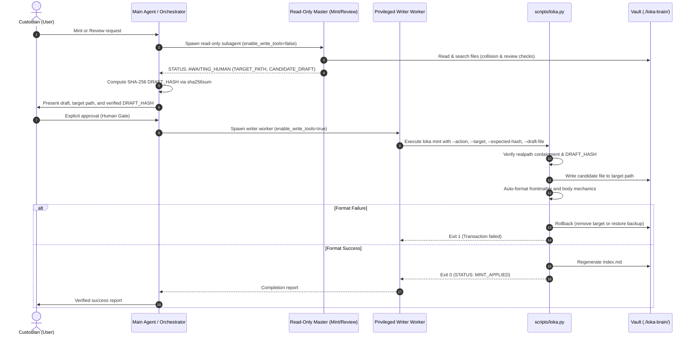

# LOKA Agent Operations & Knowledge Substrate

The `.agents` directory serves as the encapsulated operational knowledge vault and autonomous skill execution substrate for the LOKA repository. Operating under the workspace contract ([`./AGENTS.md`](./AGENTS.md)), it decouples knowledge retention, quality governance, and workflow automation from transient host runtime environments.

## Purpose

The primary purpose of `.agents` is to provide a machine-actionable, persistent knowledge architecture paired with isolated, privilege-separated agent execution skills:

1. **LOKA Knowledge Vault ([`./loka-brain/`](./loka-brain/index.md))**: A modular, machine-actionable knowledge repository governed by [`./AGENTS.md`](./AGENTS.md) and [`./loka-brain/schema.md`](./loka-brain/schema.md) (v0.3.0). It enforces linear lifecycle progression (`draft` → `test` → `active`), single-domain purity across six canonical domains (`profiles`, `behaviors`, `standards`, `workflows`, `tools`, `meta`), strict AST-compatible wikilinks, de-identification of host paths, and complete runtime-vault decoupling.
2. **Specialized Agent Skills (`./skills/`)**: Modular agent capabilities delegated to handle specific workspace tasks:
   - `loka` ([`./skills/loka/`](./skills/loka/SKILL.md)): Dual-master orchestrator managing the Knowledge Artifact lifecycle via read-only minting and review subagents, an interactive SHA-256 cryptographic Human Gate, and a transactional write worker with automated rollback.
   - `loka-git-manager` ([`./skills/loka-git-manager/`](./skills/loka-git-manager/SKILL.md)): Local Git operations manager enforcing pre-flight checks, atomic Conventional Commits, and staged secret/debug scans without external push dependencies.
   - `loka-log` ([`./skills/loka-log/`](./skills/loka-log/SKILL.md)): Workspace archivist recording immutable session evidence ledgers (`YYYY-MM-DD_HH-MM-sessionlog.json`), with delegated modes for log querying and structured session handover capture.

## Key Capabilities

- **Decoupled Knowledge Governance**: Machine-actionable knowledge vault maintaining canonical domain separation under [schema v0.3.0](./loka-brain/schema.md).
- **Dual-Master Knowledge Lifecycle Management**: Read-only subagents (`mint-master`, `review-master`) with separated privileges and interactive SHA-256 Human Gate approval for artifact minting and promotion.
- **Transactional Writes and Rollback**: Automated CLI engine ([`./skills/loka/scripts/lib/lifecycle.py`](./skills/loka/scripts/lib/lifecycle.py)) guaranteeing realpath containment, pre-flight checksum matching, atomic writes, and automated rollback on formatting or indexing failures.
- **Progressive Disclosure Catalog**: Dynamic master catalog ([`./loka-brain/index.md`](./loka-brain/index.md)) regenerated deterministically via `loka index` ([`./skills/loka/scripts/lib/indexer.py`](./skills/loka/scripts/lib/indexer.py)) with strict validation gates.
- **Mechanical Auto-Formatting**: Frontmatter key ordering, quote normalization, and whitespace mechanics enforced by `loka format` ([`./skills/loka/scripts/lib/formatter.py`](./skills/loka/scripts/lib/formatter.py)).
- **Safe Local Git Operations**: Strict pre-flight checks, branch validation, Conventional Commit formatting, and staged secret detection ([`./skills/loka-git-manager/`](./skills/loka-git-manager/SKILL.md)).
- **Session Evidence Archiving**: Structured JSON session logging, on-demand log querying, and structured session handover capture ([`./skills/loka-log/`](./skills/loka-log/SKILL.md)).

## Subsystems And Architecture

| Subsystem / Component | Path | Responsibility |
| :--- | :--- | :--- |
| **Workspace Operating Contract** | [`./AGENTS.md`](./AGENTS.md) | Authoritative operating contract, custodian mandate, portability invariants, risk tiers, and lifecycle quality gates. |
| **Format Specification** | [`./loka-brain/schema.md`](./loka-brain/schema.md) | Normative structural schema (v0.3.0) governing frontmatter fields, canonical key ordering, and Markdown structure. |
| **Master Knowledge Catalog** | [`./loka-brain/index.md`](./loka-brain/index.md) | Progressive disclosure catalog with dynamic auto-index replacement boundaries. |
| **LOKA Master Skill** | [`./skills/loka/SKILL.md`](./skills/loka/SKILL.md) | Dual-master pipeline orchestration, subagent privilege separation, and Human Gate enforcement. |
| **Mint Master Subagent** | [`./skills/loka/agents/mint-master.md`](./skills/loka/agents/mint-master.md) | Read-only subagent prompt for domain classification, collision detection, and candidate drafting. |
| **Review Master Subagent** | [`./skills/loka/agents/review-master.md`](./skills/loka/agents/review-master.md) | Read-only subagent prompt for 5-dimension content review and lifecycle advancement recommendations. |
| **Writer Worker Subagent** | [`./skills/loka/agents/writer-worker.md`](./skills/loka/agents/writer-worker.md) | Privileged write worker prompt enforcing realpath containment, pre-flight checks, and rollback. |
| **Unified CLI Suite** | [`./skills/loka/scripts/loka.py`](./skills/loka/scripts/loka.py) | CLI entry point providing `format`, `index`, `promote`, `deprecate`, `undeprecate`, and `mint`. |
| **Frontmatter Engine** | [`./skills/loka/scripts/lib/frontmatter.py`](./skills/loka/scripts/lib/frontmatter.py) | Frontmatter parser, canonical YAML renderer, and semantic validation checks. |
| **Auto-Formatter Engine** | [`./skills/loka/scripts/lib/formatter.py`](./skills/loka/scripts/lib/formatter.py) | Mechanical formatting engine for canonical key order, quote normalization, and whitespace. |
| **Deterministic Indexer** | [`./skills/loka/scripts/lib/indexer.py`](./skills/loka/scripts/lib/indexer.py) | Catalog generator with progressive disclosure descriptions and strict validation filtering. |
| **Transactional Lifecycle Engine** | [`./skills/loka/scripts/lib/lifecycle.py`](./skills/loka/scripts/lib/lifecycle.py) | Lifecycle state progression, deprecation, realpath containment, and transactional rollback. |
| **Local Git Manager** | [`./skills/loka-git-manager/SKILL.md`](./skills/loka-git-manager/SKILL.md) | Local Git management skill enforcing atomic Conventional Commits, pre-flight checks, and staged secret scans. |
| **Session Archivist** | [`./skills/loka-log/SKILL.md`](./skills/loka-log/SKILL.md) | Archivist skill managing session-end logging, log querying, and session handover capture. |

## Execution Workflows

### Dual-Master Knowledge Artifact Pipeline

The Knowledge Artifact lifecycle separates read-only analysis from privileged transactional mutations through an explicit cryptographic Human Gate:



### Git Safety and Session Logging Workflows

- **Git Safety Pipeline (`loka-git-manager`)**: Executes working directory and branch verification, runs staged secret and whitespace scans (`git diff --cached --check`, `git diff --cached -G`), and creates atomic Conventional Commits without automatic push.
- **Session Logging Pipeline (`loka-log`)**: Validates repository state and records structured session evidence into `./memories/sessions/YYYY-MM-DD_HH-MM-sessionlog.json` (Mode A, default). Delegated on explicit request: log querying against existing session logs (Mode B), or structured session handover capture into `./memories/handovers/YYYY-MM-DD_HH-MM-session-handover.md` (Mode C).

## Operational Commands

The Python CLI suite (`./skills/loka/scripts/loka.py`) provides commands for formatting, indexing, and lifecycle management:

### Auto-Formatting

- **Format Check:**
  ```bash
  python3 ./skills/loka/scripts/loka.py format --check ./loka-brain/<domain>/<file>.md
  ```
- **Format Whole Vault:**
  ```bash
  python3 ./skills/loka/scripts/loka.py format --all
  ```

### Catalog Generation

- **Deterministic Index Regeneration:**
  ```bash
  python3 ./skills/loka/scripts/loka.py index
  ```
- **Strict Validation Indexing:**
  ```bash
  python3 ./skills/loka/scripts/loka.py index --strict
  ```

### Lifecycle Progression & Deprecation

- **Promote Status (`draft` → `test` → `active`):**
  ```bash
  python3 ./skills/loka/scripts/loka.py promote ./loka-brain/<domain>/<file>.md
  ```
- **Mark Deprecated (`deprecated: true`):**
  ```bash
  python3 ./skills/loka/scripts/loka.py deprecate ./loka-brain/<domain>/<file>.md
  ```
- **Restore Deprecated (`deprecated: false`):**
  ```bash
  python3 ./skills/loka/scripts/loka.py undeprecate ./loka-brain/<domain>/<file>.md
  ```

### Transactional Mint Engine

- **Mint New Artifact:**
  ```bash
  python3 ./skills/loka/scripts/loka.py mint --action NEW_MINT --target <target_path> --expected-hash <sha256> --draft-file <file>
  ```
- **Merge Existing Artifact:**
  ```bash
  python3 ./skills/loka/scripts/loka.py mint --action MERGE --target <target_path> --expected-hash <sha256> --draft-file <file> --base-hash <sha256>
  ```

## Technical Dependencies

- **Runtime**: Python 3 (standard library only; zero external package dependencies).
- **Version Control**: `git` CLI (v2.x+).
- **Subagent Platform**: Antigravity runtime supporting `define_subagent` and `invoke_subagent` with privilege controls (`enable_write_tools`).

## Important Notes And Limitations

- **Cryptographic Hash Rigidity**: `loka mint` enforces strict byte-for-byte SHA-256 verification against the Human Gate approval. Unintentional modifications, trailing whitespace, or line ending conversions will cause hash mismatches and immediate pre-flight abortion.
- **Runtime Privilege Enforcement**: Privilege separation between read-only masters (`mint-master`, `review-master`) and the write worker relies on host platform enforcement of `enable_write_tools: false`. In environments without tool restriction controls, isolation depends on prompt-level compliance.
- **Transactional Rollback**: When formatting fails or an unexpected write error occurs during `loka mint`, `promote`, or `deprecate`, the engine automatically rolls back changes, restoring the previous file state or removing newly created files.
- **Local Git Boundaries**: The `loka-git-manager` skill strictly forbids autonomous git push operations, unconfirmed pushes to `main`, and GitHub release CLI interactions.
- **On-Demand Memory Directory**: The runtime memory storage directory (`./memories/`) is omitted from version control and is created dynamically upon execution of `loka-log`.
