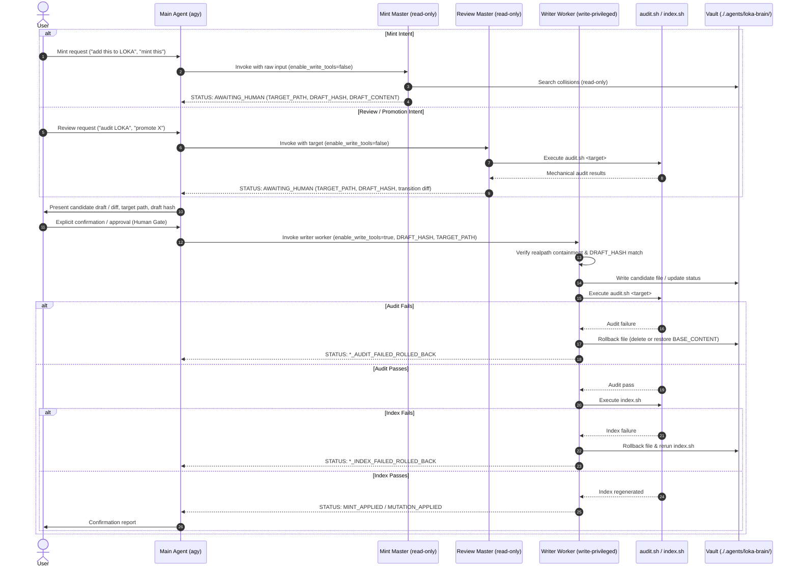

# loka

`loka` is a dual-master orchestration skill governing the Knowledge Artifact (KA) lifecycle in `./.agents/loka-brain/` in compliance with the schema.md v0.2.3 format schema. It isolates authoring and auditing into read-only pipelines, requires human confirmation at a cryptographic Human Gate, and delegates all vault mutations to a dedicated privileged write worker with automated rollback protection.

## Purpose

The skill manages the end-to-end lifecycle of Knowledge Artifacts across canonical domains while enforcing strict structural integrity, redaction standards, and isolation boundaries:

- **Isolated Dual-Master Pipelines:** Separates operations into read-only minting (`loka-mint-master`) for collision detection and drafting, and read-only reviewing (`loka-review-master`) for mechanical verification and content audits.
- **Cryptographic Human Gate:** Enforces human confirmation on all vault mutations using SHA-256 draft hash verification to guarantee that persisted content matches user-approved drafts.
- **Safe Mutation and Rollback:** Executes mutations through a dedicated worker (`loka-writer`) and transactional engine (`scripts/apply_mint.sh`) with realpath containment within `./.agents/loka-brain/`, executing mechanical audits and catalog indexing, with automated rollbacks on any failure.
- **Session Retrospective Distillation:** Bundles an independent context distillation prompt (`prompts/retrospective.prompt.md`) to append technical post-mortems to `./.agents/loka-brain/retrospectives.md`.

## Key Capabilities

- **Dual-Master Orchestration:** Dispatches user intent to isolated read-only orchestrators (`mint-master` or `review-master`), preventing accidental vault writes during drafting or evaluation.
- **Pre-Commit Cryptographic Verification:** Computes SHA-256 hashes of proposed drafts (`DRAFT_HASH`) and existing files (`BASE_HASH`), validating byte integrity before executing mutations.
- **Atomic Mutation Sequencing:** Executes pre-flight in-memory validation, realpath containment checks, write operations, automated mechanical auditing, and index regeneration in a strict sequence with rollback on error.
- **Automated Mechanical Auditing:** Verifies frontmatter schemas, domain classification, path leakage, credential patterns, heading structures, and wikilink integrity via `scripts/audit.sh`.
- **Two-Axis Lifecycle Governance:** Supports linear lifecycle promotion (`draft` → `test` → `active`) alongside orthogonal deprecation states (`deprecated: true|false`).
- **Progressive Disclosure Indexing:** Dynamically regenerates progressive disclosure tables in `./.agents/loka-brain/index.md` between explicit marker boundaries using `scripts/index.sh`.
- **Structured Frontmatter Parsing:** Shared POSIX/AWK library (`scripts/lib/parse_frontmatter.sh`) parses SCHEMA v0.2.3 frontmatter fields (4 mandatory, 7 optional) and validates YAML format requirements.

## Architecture And Components

The skill coordinates specialized subagent roles and shell utilities to manage artifact workflows:

| Component | Responsibility | Reference |
| :--- | :--- | :--- |
| `SKILL.md` | Skill metadata, dual-master workflow definitions, runtime configuration contracts, and operational boundaries. | `SKILL.md` |
| `agents/mint-master.md` | Read-only mint orchestrator prompt: domain classification, collision detection, SCHEMA v0.2.3 drafting, and Human Gate payload formatting. | `agents/mint-master.md` |
| `agents/review-master.md` | Read-only review orchestrator prompt: mechanical audit execution, 5-dimension content review, and transition decision preparation. | `agents/review-master.md` |
| `agents/writer-worker.md` | Privileged write worker prompt: realpath containment, pre-flight checks, cryptographic verification, audit/index sequencing, and automated rollback. | `agents/writer-worker.md` |
| `prompts/retrospective.prompt.md` | Standalone prompt template (`session-retrospective` v1.1.0) for context distillation prepended to `./.agents/loka-brain/retrospectives.md`. | `prompts/retrospective.prompt.md` |
| `scripts/lib/parse_frontmatter.sh` | Shared shell library providing `parse_frontmatter()` using AWK to extract and validate frontmatter fields. | `scripts/lib/parse_frontmatter.sh` |
| `scripts/apply_mint.sh` | Transactional CLI engine for atomic artifact minting, realpath containment, whitespace linting, and automated rollbacks. | `scripts/apply_mint.sh` |
| `scripts/audit.sh` | CLI utility for automated structural checks, path/secret de-identification, markdown validation, and lifecycle transitions. | `scripts/audit.sh` |
| `scripts/index.sh` | CLI utility for generating progressive disclosure tables in `./.agents/loka-brain/index.md`. | `scripts/index.sh` |

### Orchestration Workflow



## Canonical Taxonomy And Schema

Knowledge Artifacts are categorized into 6 canonical domain folders within `./.agents/loka-brain/`:

- `profiles`: Identity, tone, formatting standards, and persona specifications (`./.agents/loka-brain/profiles/`).
- `behaviors`: Decision boundaries, fallbacks, and uncertainty handling (`./.agents/loka-brain/behaviors/`).
- `standards`: Output schemas, quality gates, and format definitions (`./.agents/loka-brain/standards/`).
- `workflows`: Multi-step processes, review pipelines, and operational sequences (`./.agents/loka-brain/workflows/`).
- `tools`: Tool usage policies, subagent execution definitions, and CLI integration guidelines (`./.agents/loka-brain/tools/`).
- `meta`: Vault taxonomy governance, versioning policies, and skill specifications (`./.agents/loka-brain/meta/`).

### Frontmatter Specification (SCHEMA v0.2.3)

Every artifact must begin on line 1 with a YAML frontmatter block enclosed between `---` delimiters (4 mandatory fields, up to 7 optional fields):

| Field Name | Requirement | Type / Format | Validation Constraint |
|---|---|---|---|
| `id` | Mandatory | String (`^[a-z0-9-]+$`) | Unique lowercase `kebab-case` identifier. Must match the filename stem exactly without conversion. |
| `name` | Mandatory | String (UTF-8) | Human-readable artifact title. Must match the level-1 Markdown heading (`# <Title>`) verbatim. |
| `type` | Mandatory | Enum String | Canonical domain: `profile`, `behavior`, `standard`, `workflow`, `tool`, `meta`. Must match the parent domain folder name in singular form. |
| `description` | Mandatory | String (UTF-8) | Non-empty concise single-line description surfaced in index catalogs (`index.md`) for progressive disclosure. |
| `status` | Optional | Enum String | Operational lifecycle status: `draft`, `test`, `active`. If omitted, the artifact is treated as unpromoted working draft. |
| `deprecated` | Optional | Boolean Literal | Supersession flag: `false` or `true`. Defaults to `false` if omitted. |
| `created` | Optional | ISO-8601 Date (`YYYY-MM-DD`) | Creation date matching `^[0-9]{4}-[0-9]{2}-[0-9]{2}$`. Emitted unquoted. |
| `stale_after` | Optional | ISO-8601 Date (`YYYY-MM-DD`) | OKF v0.2 Freshness trust signal matching `^[0-9]{4}-[0-9]{2}-[0-9]{2}$`. Emitted unquoted. |
| `owner` | Optional | String (UTF-8) | Custodian tracking identifier (e.g. `custodian`). |
| `verified` | Optional | Enum String | OKF v0.2 Trustworthiness signal: `human`, `attested`, or `automated`. Emitted unquoted. |
| `sources` | Optional | Inline Array (`["..."]`) | OKF v0.2 Provenance signal: inline JSON/YAML array of URI or source references matching `^\[.*\]$`. |

*Note: The legacy `time` field is strictly prohibited under SCHEMA v0.2.3.*

## Tooling And CLI Interfaces

### Mechanical Audit Tool (`scripts/audit.sh`)

Automates structural validation, redaction checks, and lifecycle state changes:

```bash
# Audit all artifacts across all canonical domains
./scripts/audit.sh --all

# Audit a single artifact
./scripts/audit.sh ./.agents/loka-brain/standards/example-standard.md

# Promote an artifact along the linear lifecycle (draft -> test -> active)
./scripts/audit.sh --promote ./.agents/loka-brain/standards/example-standard.md

# Promote all eligible artifacts passing audit
./scripts/audit.sh --promote-all

# Toggle deprecation status
./scripts/audit.sh --deprecate ./.agents/loka-brain/standards/example-standard.md
./scripts/audit.sh --undeprecate ./.agents/loka-brain/standards/example-standard.md
```

### Vault Index Generator (`scripts/index.sh`)

Regenerates the catalog in `./.agents/loka-brain/index.md` between `<!-- AUTO-INDEX:START -->` and `<!-- AUTO-INDEX:END -->` markers:

```bash
# Update index using discovery fallback
./scripts/index.sh

# Update index with explicit brain root path
./scripts/index.sh /path/to/.agents/loka-brain
```

### Shared Frontmatter Parser (`scripts/lib/parse_frontmatter.sh`)

Extracts frontmatter variables for POSIX shell scripts:

```bash
# Source function in scripts
source ./scripts/lib/parse_frontmatter.sh
parse_frontmatter "$target_file"

# Direct CLI execution
./scripts/lib/parse_frontmatter.sh ./.agents/loka-brain/standards/example-standard.md
```

### Environment Variables

- `LOKA_BRAIN_ROOT`: Optional vault path override. When unset, scripts search upward for `loka-brain` or fall back to `../../../../loka-brain`.
- `TMPDIR`: Temporary directory used for atomic backup and replacement during mutations (defaults to `/tmp`).

## Important Notes And Limitations

- **Subagent Permission Dependency:** Read-only guarantees for `loka-mint-master` and `loka-review-master` depend on runtime enforcement of `enable_write_tools: false`. If run in an environment that does not restrict tools, isolation relies on prompt adherence.
- **Draft Hash Precision:** The `loka-writer` requires an exact SHA-256 match (`DRAFT_HASH`). Unintended modifications, such as trailing whitespace adjustments or CRLF newline conversions, will cause mutations to abort.
- **Temporary Backup Files:** Promotions and deprecations in `scripts/audit.sh` write temporary backups to `$TMPDIR` (`ka_promote_backup.XXXXXX` or `ka_dep_backup.XXXXXX`). Abnormal termination via unhandled `SIGKILL` can leave orphan backup files in the temporary directory.
- **Strict Markdown Heading Structure:** Artifact bodies must strictly match either `Context -> Mechanism -> Rules` or `Context -> Mechanism -> Implementation -> Rules` heading sequences. Unrecognized or empty headings will cause audit failures.
- **Wikilink Boundary Constraints:** All wikilinks (`[[target]]`) must resolve to existing files within the 6 canonical domain folders. Links pointing to external files outside the domain folders trigger audit failures.
- **Hardcoded Path Restrictions:** Artifact bodies must not contain absolute filesystem references matching `/home/`, `/mnt/`, `/tmp/`, or `/root/`.
- **Independent Retrospective Distillation:** `prompts/retrospective.prompt.md` writes directly to `docs/retrospectives.md` and does not run through `audit.sh`, `index.sh`, or the SHA-256 Human Gate pipeline.
- **Identified Unknowns:**
  - Portability of the AGY subagent execution specification (`define_subagent`, `invoke_subagent`) to platforms other than the Antigravity CLI runtime is unverified.
  - Compatibility of shell utilities (`audit.sh`, `index.sh`, `parse_frontmatter.sh`) on native Windows environments without POSIX emulation is unverified.
  - Existence of external linting or validation tooling for `docs/retrospectives.md` outside the skill repository is unverified.
