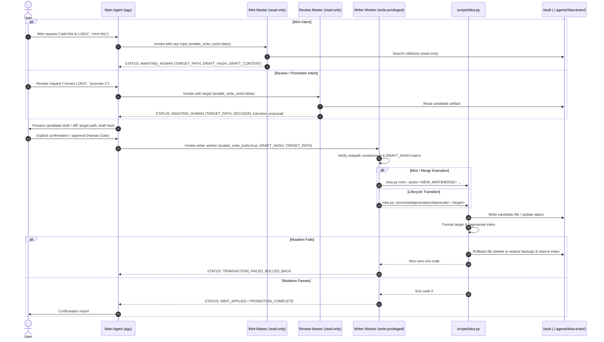

# loka

`loka` is a dual-master orchestration skill governing the Knowledge Artifact (KA) lifecycle in `./.agents/loka-brain/` in compliance with the schema.md v0.3.0 format schema. It isolates authoring and review into read-only pipelines, requires human confirmation at a cryptographic Human Gate, and delegates all vault mutations to a dedicated privileged write worker with automated rollback protection.

## Purpose

The skill manages the end-to-end lifecycle of Knowledge Artifacts across canonical domains while enforcing strict structural integrity, redaction standards, and isolation boundaries:

- **Isolated Dual-Master Pipelines:** Separates operations into read-only minting (`loka-mint-master`) for collision detection and drafting, and read-only reviewing (`loka-review-master`) for 5-dimension qualitative and structural peer evaluation.
- **Cryptographic Human Gate:** Enforces human confirmation on all vault mutations using SHA-256 draft hash verification to guarantee that persisted content matches user-approved drafts.
- **Safe Mutation and Rollback:** Executes mutations through a dedicated worker (`loka-writer`) and transactional engine (`scripts/loka.py mint`, `scripts/loka.py promote`) with realpath containment within `./.agents/loka-brain/`, executing mechanical formatting and catalog indexing, with automated rollbacks on any failure.
- **Session Retrospective Distillation:** Bundles an independent context distillation prompt (`prompts/retrospective.prompt.md`) to append technical post-mortems to `./.agents/loka-brain/retrospectives.md`.

## Key Capabilities

- **Dual-Master Orchestration:** Dispatches user intent to isolated read-only orchestrators (`mint-master` or `review-master`), preventing accidental vault writes during drafting or evaluation.
- **Pre-Commit Cryptographic Verification:** Computes SHA-256 hashes of proposed drafts (`DRAFT_HASH`) and existing files (`BASE_HASH`), validating byte integrity before executing mutations.
- **Atomic Mutation Sequencing:** Executes pre-flight in-memory validation, realpath containment checks, write operations, automated mechanical formatting, and index regeneration in a strict sequence with rollback on error.
- **Mechanical Auto-Formatting:** Enforces canonical key order, compact delimiters, redundant/required quoting rules, trailing whitespace removal, and single trailing newline via `scripts/loka.py format`.
- **Two-Axis Lifecycle Governance:** Supports linear lifecycle promotion (`draft` → `test` → `active`) alongside orthogonal deprecation states (`deprecated: true|false`).
- **Progressive Disclosure Indexing:** Dynamically regenerates progressive disclosure tables in `./.agents/loka-brain/index.md` between explicit marker boundaries using `scripts/loka.py index`.
- **Structured Frontmatter Parsing:** Python library (`scripts/lib/frontmatter.py`) parses SCHEMA v0.3.0 frontmatter fields (4 mandatory, 7 optional) and validates YAML format requirements.

## Architecture And Components

The skill coordinates specialized subagent roles and Python utilities to manage artifact workflows:

| Component | Responsibility | Reference |
| :--- | :--- | :--- |
| `SKILL.md` | Skill metadata, dual-master workflow definitions, runtime configuration contracts, and operational boundaries. | `SKILL.md` |
| `agents/mint-master.md` | Read-only mint orchestrator prompt: domain classification, collision detection, SCHEMA v0.3.0 drafting, and Human Gate payload formatting. | `agents/mint-master.md` |
| `agents/review-master.md` | Read-only review orchestrator prompt: 5-dimension semantic peer review, format verification, and transition recommendation. | `agents/review-master.md` |
| `agents/writer-worker.md` | Privileged write worker prompt: realpath containment, pre-flight checks, cryptographic verification, format/index sequencing, and automated rollback. | `agents/writer-worker.md` |
| `prompts/retrospective.prompt.md` | Standalone prompt template (`session-retrospective` v1.1.0) for context distillation prepended to `./.agents/loka-brain/retrospectives.md`. | `prompts/retrospective.prompt.md` |
| `scripts/loka.py` | Unified CLI entry point (`format`, `index`, `promote`, `deprecate`, `undeprecate`, `mint`). | `scripts/loka.py` |
| `scripts/lib/frontmatter.py` | Frontmatter parser and serializer for SCHEMA v0.3.0. | `scripts/lib/frontmatter.py` |
| `scripts/lib/formatter.py` | Mechanical frontmatter and markdown formatting engine. | `scripts/lib/formatter.py` |
| `scripts/lib/indexer.py` | Progressive disclosure catalog indexing engine. | `scripts/lib/indexer.py` |
| `scripts/lib/lifecycle.py` | Lifecycle progression (`promote`, `deprecate`, `undeprecate`) and transactional mint engine. | `scripts/lib/lifecycle.py` |

### Orchestration Workflow



## Canonical Taxonomy And Schema

Knowledge Artifacts are categorized into 6 canonical domain folders within `./.agents/loka-brain/`:

- `profiles`: Identity, tone, formatting standards, and persona specifications (`./.agents/loka-brain/profiles/`).
- `behaviors`: Decision boundaries, fallbacks, and uncertainty handling (`./.agents/loka-brain/behaviors/`).
- `standards`: Output schemas, quality gates, and format definitions (`./.agents/loka-brain/standards/`).
- `workflows`: Multi-step processes, review pipelines, and operational sequences (`./.agents/loka-brain/workflows/`).
- `tools`: Tool usage policies, subagent execution definitions, and CLI integration guidelines (`./.agents/loka-brain/tools/`).
- `meta`: Vault taxonomy governance, versioning policies, and skill specifications (`./.agents/loka-brain/meta/`).

### Frontmatter Specification (SCHEMA v0.3.0)

Every artifact must begin on line 1 with a YAML frontmatter block enclosed between `---` delimiters (4 mandatory fields, up to 7 optional fields):

| Field Name | Requirement | Type / Format | Validation Constraint |
|---|---|---|---|
| `id` | Mandatory | String (`^[a-z0-9-]+$`) | Unique lowercase `kebab-case` identifier. Must match the filename stem exactly without conversion. |
| `name` | Mandatory | String (UTF-8) | Human-readable artifact title. Must match the level-1 Markdown heading (`# <Title>`) verbatim. |
| `type` | Mandatory | Enum String | Canonical domain: `profile`, `behavior`, `standard`, `workflow`, `tool`, `meta`. Must match the parent domain folder name in singular form. |
| `status` | Optional | Enum String | Operational lifecycle status: `draft`, `test`, `active`. Defaults to `draft` if omitted. |
| `deprecated` | Optional | Boolean Literal | Supersession flag: `false` or `true`. Defaults to `false` if omitted. |
| `description` | Mandatory | String (UTF-8) | Non-empty concise single-line description surfaced in index catalogs (`index.md`) for progressive disclosure. |
| `created` | Optional | ISO-8601 Date (`YYYY-MM-DD`) | Creation date matching `^[0-9]{4}-[0-9]{2}-[0-9]{2}$`. Emitted unquoted. |
| `stale_after` | Optional | ISO-8601 Date (`YYYY-MM-DD`) | OKF v0.2 Freshness trust signal matching `^[0-9]{4}-[0-9]{2}-[0-9]{2}$`. Emitted unquoted. |
| `owner` | Optional | String (UTF-8) | Custodian tracking identifier (e.g. `custodian`). |
| `verified` | Optional | Enum String | OKF v0.2 Trustworthiness signal: `human`, `attested`, or `automated`. Emitted unquoted. |
| `sources` | Optional | Inline Array (`["..."]`) | OKF v0.2 Provenance signal: inline YAML array of double-quoted URI or source references matching `^\[.*\]$`. |

*Note: The legacy `time` field is strictly prohibited under SCHEMA v0.3.0.*

## Tooling And CLI Interfaces (`scripts/loka.py`)

The unified Python CLI suite provides all mechanical formatting, catalog generation, and lifecycle operations:

### Auto-Format (`format`)

Enforces canonical key order, compact delimiters, redundant/required quoting, and trailing whitespace cleanup:

```bash
# Format a specific artifact
./.agents/skills/loka/scripts/loka.py format ./.agents/loka-brain/standards/example-standard.md

# Format all artifacts across canonical domains
./.agents/skills/loka/scripts/loka.py format --all

# Check formatting without modifying files (exit code 1 if changes needed)
./.agents/skills/loka/scripts/loka.py format --all --check
```

### Catalog Indexing (`index`)

Regenerates the progressive disclosure catalog in `./.agents/loka-brain/index.md` between `<!-- AUTO-INDEX:START -->` and `<!-- AUTO-INDEX:END -->` markers:

```bash
# Regenerate index using auto-discovery
./.agents/skills/loka/scripts/loka.py index

# Regenerate index with strict validation (exit code 1 on skipped artifacts)
./.agents/skills/loka/scripts/loka.py index --strict
```

### Lifecycle Progression (`promote`, `deprecate`, `undeprecate`)

Safely advances artifact lifecycle states with automated formatting, index regeneration, and rollback on error:

```bash
# Advance lifecycle exactly one step (draft -> test, or test -> active)
./.agents/skills/loka/scripts/loka.py promote ./.agents/loka-brain/standards/example-standard.md

# Mark an artifact as deprecated
./.agents/skills/loka/scripts/loka.py deprecate ./.agents/loka-brain/standards/example-standard.md

# Restore a deprecated artifact
./.agents/skills/loka/scripts/loka.py undeprecate ./.agents/loka-brain/standards/example-standard.md
```

### Transactional Minting (`mint`)

Executes new artifact creation (`NEW_MINT`) or merging (`MERGE`) with SHA-256 hash checks, formatting, and atomic rollbacks:

```bash
# Mint a new artifact
./.agents/skills/loka/scripts/loka.py mint \
  --action NEW_MINT \
  --target ./.agents/loka-brain/standards/new-standard.md \
  --draft-file /path/to/draft.tmp \
  --expected-hash <sha256>

# Merge into an existing artifact
./.agents/skills/loka/scripts/loka.py mint \
  --action MERGE \
  --target ./.agents/loka-brain/standards/existing-standard.md \
  --draft-file /path/to/merged.tmp \
  --expected-hash <sha256> \
  --base-hash <sha256>
```

## Important Notes And Limitations

- **Subagent Permission Dependency:** Read-only guarantees for `loka-mint-master` and `loka-review-master` depend on runtime enforcement of `enable_write_tools: false`.
- **Draft Hash Precision:** The `loka-writer` and `loka.py mint` require an exact SHA-256 match (`DRAFT_HASH`).
- **Strict Markdown Heading Structure:** Artifact bodies must match either `Context -> Mechanism -> Rules` or `Context -> Mechanism -> Implementation -> Rules` heading sequences.
- **Wikilink Boundary Constraints:** All wikilinks (`[[target]]`) must resolve to existing files within canonical domain folders.
- **Hardcoded Path Restrictions:** Artifact bodies must not contain absolute filesystem references matching `/home/`, `/mnt/`, `/tmp/`, or `/root/`.
