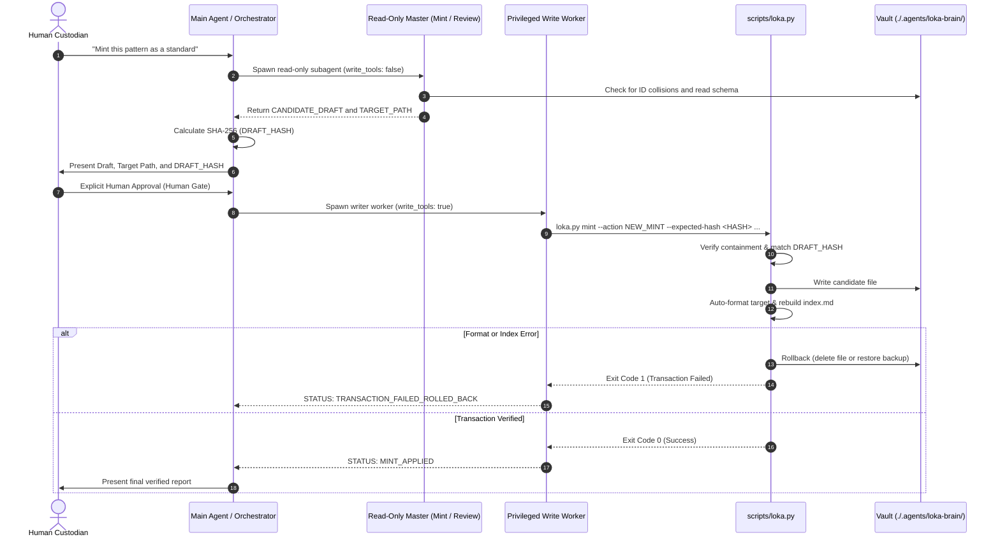

# LOKA — Local Open Knowledge Artifact

[](./.agents/loka-brain/schema.md)
[](https://www.python.org/)
[](./.agents/skills/loka/scripts/tests/)
[](https://opensource.org/licenses/MIT)
[](./.agents/AGENTS.md)

> **Modular, machine-actionable, and vendor-neutral Knowledge Artifact architecture and governance framework for human engineers and autonomous agents.**

---

## 1. Description

**LOKA (Local Open Knowledge Artifact)** is an open-source knowledge governance framework and machine-actionable knowledge vault designed to store, validate, and retrieve institutional engineering knowledge. By enforcing strict **runtime-vault decoupling**, LOKA guarantees that knowledge artifacts remain self-contained, portable, and machine-actionable across diverse Large Language Models (LLMs), CLI coding agents, and developer environments without vendor lock-in.

### Why LOKA Exists

Modern AI coding agents and autonomous development workflows suffer from four major knowledge bottlenecks:

1. **Context Bloat & Token Saturation:** Blindly injecting entire documentation folders or monolithic instruction sets exhausts context windows, degrades attention mechanisms, and drives up token costs.
2. **Vendor Lock-In & Runtime Coupling:** Rules and domain standards are frequently entangled with proprietary runtime features or specific IDE prompts, preventing cross-tool reuse.
3. **Uncontrolled Drift & Hallucinated Mutations:** Autonomous agents often hallucinate structural changes, overwrite unbacked files, silently alter schemas, or mutate historical records without human oversight.
4. **Lack of Verifiable Quality Gates:** Unstructured Markdown files cannot be mechanically audited, deterministically indexed, or systematically verified against concrete schemas.

LOKA resolves these failure modes by treating institutional knowledge as a structural data substrate: Markdown-based **Knowledge Artifacts (KAs)** governed by strict YAML frontmatter, deterministic heading sequences, binary quality gates, progressive disclosure indexing, and an explicit cryptographic **Human Gate** backed by transactional rollback protection.

### Key Features

- **Strict Normative Schema (v0.3.0):** Every Knowledge Artifact adheres to the normative format specification ([`./.agents/loka-brain/schema.md`](./.agents/loka-brain/schema.md)) across six canonical domains (`profiles`, `behaviors`, `standards`, `workflows`, `tools`, `meta`). Invariants are evaluated strictly as binary `PASS` or `FAIL`.
- **Runtime-Vault Decoupling:** Knowledge artifacts contain zero host paths, platform-specific environment variables, or private container identities. Tooling interacts with knowledge strictly via Abstract Syntax Tree (AST) parsing and frontmatter extraction.
- **Economical Context Retrieval:** Progressive disclosure via the dynamic Master Catalog ([`./.agents/loka-brain/index.md`](./.agents/loka-brain/index.md)) ensures agents load only the minimal 1–3 essential modules required for an active task, preventing context pollution.
- **Dual-Master Orchestration with Cryptographic Human Gate:** Authoring and peer review are segregated into read-only pipelines (`loka-mint-master` and `loka-review-master`). Modifications require explicit human confirmation against a byte-exact SHA-256 digest before a privileged worker executes changes.
- **Transactional State Engine with Automated Rollback:** Built-in atomic write mechanics verify realpath containment and digest checksums before executing mutations. Any formatting or indexing failure automatically triggers an atomic rollback.
- **Zero-Dependency Python CLI Suite:** Pure Python standard-library implementation ([`./.agents/skills/loka/scripts/loka.py`](./.agents/skills/loka/scripts/loka.py)) provides fast, zero-dependency tools for formatting, catalog indexing, lifecycle transitions, and minting.
- **Encapsulated Framework Substrate:** Fully encapsulated inside `./.agents/`, eliminating root-level collisions and enabling seamless embedding into any host repository.

### What Makes LOKA Unique

Unlike static wiki engines or freeform prompt collections, LOKA operates under an absolute **Custodian Mandate**: autonomous agents operate strictly under *custody*, never with *ownership rights*. All mutations are two-phase committed with cryptographic verification and automatic rollbacks, making LOKA a robust persistent memory and governance substrate for autonomous agent fleets.

---

## 2. Table of Contents

- [1. Description](#1-description)
- [2. Table of Contents](#2-table-of-contents)
- [3. Architecture & Vault Structure](#3-architecture--vault-structure)
- [4. Installation & Prerequisites](#4-installation--prerequisites)
- [5. Quick Start & Common Usage](#5-quick-start--common-usage)
- [6. CLI Reference](#6-cli-reference)
- [7. Python Library API](#7-python-library-api)
- [8. Configuration & Environment Variables](#8-configuration--environment-variables)
- [9. Knowledge Artifact Schema & Life Cycle](#9-knowledge-artifact-schema--life-cycle)
- [10. Workflows & Orchestration Examples](#10-workflows--orchestration-examples)
- [11. Development & Testing](#11-development--testing)
- [12. Troubleshooting](#12-troubleshooting)
- [13. Roadmap](#13-roadmap)
- [14. Contributing & Custodian Protocol](#14-contributing--custodian-protocol)
- [15. License](#15-license)
- [16. Authors & Acknowledgments](#16-authors--acknowledgments)
- [17. Support & Contact](#17-support--contact)

---

## 3. Architecture & Vault Structure

LOKA organizes knowledge, skills, and governance into clear functional layers under `./.agents/`:

```text
loka-master/
├── AGENTS.md                          # Root discovery bootstrap shim for external agents
├── CHANGELOG.md                       # Repository change log (Keep a Changelog standard)
├── README.md                          # Project documentation and quickstart guide
└── .agents/
    ├── AGENTS.md                      # Single Source of Truth: Operating Contract & Agent Governance
    ├── README.md                      # Detailed agent runtime architecture and sequence specs
    ├── loka-brain/                    # Encapsulated Knowledge Vault
    │   ├── index.md                   # Auto-generated Master Catalog (progressive disclosure)
    │   ├── schema.md                  # Normative Knowledge Artifact Format Specification (v0.3.0)
    │   ├── profiles/                  # Personas, tone, and communication baselines
    │   ├── behaviors/                 # Safety boundaries, Ask-vs-Act thresholds, reading doctrines
    │   ├── standards/                 # Technical schemas, quality gates, and format definitions
    │   ├── workflows/                 # Deterministic execution flows and review procedures
    │   ├── tools/                     # Tooling policies, runtime constraints, and role definitions
    │   └── meta/                      # Architectural records, taxonomy, and changelog governance
    ├── memories/                      # Immutable session audit logs and handovers
    │   └── sessions/                  # Factual execution ledgers (YYYY-MM-DD_HH-MM-sessionlog.json)
    └── skills/                        # Modular Agent Capabilities
        ├── loka/                      # Master Orchestrator, CLI tooling, and subagents (v0.3.0)
        │   ├── SKILL.md               # Master skill definition and runtime contracts
        │   ├── agents/                # Isolated subagent prompts (mint-master, review-master, writer-worker)
        │   ├── scripts/               # Python CLI (loka.py) and test suite
        │   └── prompts/               # Standalone context distillation prompts
        ├── loka-git-manager/          # Local Git safety, pre-flight checks, and atomic commits (v0.2.0)
        └── loka-log/                  # Session memory, factual logging, and context handovers (v0.2.7)
```

---

## 4. Installation & Prerequisites

### Prerequisites

- **Python:** Version `3.10` or higher (verified up to Python `3.14`).
- **Standard Library Only:** Zero external pip dependencies required.
- **Operating System:** Linux, macOS, or Windows (via WSL2 or Git Bash).
- **Version Control:** Git `2.x` or higher.

### Installation Steps

1. **Clone the repository:**
   ```bash
   git clone https://github.com/Budtender3000/loka-master.git
   cd loka-master
   ```

2. **Verify Python environment:**
   ```bash
   python3 --version
   ```

3. **Verify the LOKA CLI executable:**
   ```bash
   python3 ./.agents/skills/loka/scripts/loka.py --help
   ```

4. *(Optional)* **Configure a shell alias for convenience:**

   **Fish Shell:**
   ```fish
   alias loka "python3 (pwd)/.agents/skills/loka/scripts/loka.py"
   funcsave loka
   ```

   **Bash / Zsh:**
   ```bash
   alias loka="python3 $(pwd)/.agents/skills/loka/scripts/loka.py"
   ```

---

## 5. Quick Start & Common Usage

All core operations are executed via the unified Python CLI at `./.agents/skills/loka/scripts/loka.py`.

### 1. Verify Formatting (Dry Run)

Check all Knowledge Artifacts in the vault for formatting compliance without modifying any files:

```bash
python3 ./.agents/skills/loka/scripts/loka.py format --check --all
```

**Expected Output:**
```text
Format Summary:
  Files checked:  6
  Files needing changes: 0
```

### 2. Auto-Format Artifacts

Mechanically reorder frontmatter keys into canonical sequence, normalize quotes, remove blank lines inside frontmatter, and strip trailing whitespace:

```bash
# Format a specific artifact
python3 ./.agents/skills/loka/scripts/loka.py format ./.agents/loka-brain/standards/my-standard.md

# Format all artifacts in the vault
python3 ./.agents/skills/loka/scripts/loka.py format --all
```

### 3. Regenerate the Master Catalog

Scan all canonical domain folders and deterministically rebuild the progressive disclosure index in `./.agents/loka-brain/index.md`:

```bash
python3 ./.agents/skills/loka/scripts/loka.py index
```

To exit with a non-zero status if any file fails validation during indexing:

```bash
python3 ./.agents/skills/loka/scripts/loka.py index --strict
```

### 4. Advance Artifact Lifecycle Status

Transition an artifact strictly one step forward along the linear path (`draft` → `test` → `active`):

```bash
python3 ./.agents/skills/loka/scripts/loka.py promote ./.agents/loka-brain/standards/my-standard.md
```

**Expected Output:**
```text
[PROMOTED] ./.agents/loka-brain/standards/my-standard.md (draft -> test)
Index updated: ./.agents/loka-brain/index.md
```

### 5. Deprecate or Restore an Artifact

Mark an obsolete artifact as a historical tombstone (`deprecated: true`) without deleting it:

```bash
python3 ./.agents/skills/loka/scripts/loka.py deprecate ./.agents/loka-brain/standards/old-standard.md
```

To reverse deprecation:

```bash
python3 ./.agents/skills/loka/scripts/loka.py undeprecate ./.agents/loka-brain/standards/old-standard.md
```

---

## 6. CLI Reference

```text
usage: loka [-h] {format,index,promote,deprecate,undeprecate,mint} ...
```

| Subcommand | Description | Arguments & Flags |
|---|---|---|
| `format` | Auto-format frontmatter and body mechanics. | `[files ...]`: Specific Markdown files.<br>`--all`: Format all artifacts in vault.<br>`--check`: Report files needing changes (exit 1) without writing.<br>`--vault <PATH>`: Custom vault path. |
| `index` | Generate deterministic `index.md` catalog. | `[vault]`: Optional vault path positional argument.<br>`--strict`: Return exit code 1 if any file fails validation and is skipped. |
| `promote` | Advance lifecycle status (`draft` → `test` → `active`). | `<file>`: Target artifact to promote.<br>`--vault <PATH>`: Custom vault path. |
| `deprecate` | Mark an artifact as deprecated (`deprecated: true`). | `<file>`: Target artifact to deprecate.<br>`--vault <PATH>`: Custom vault path. |
| `undeprecate` | Clear deprecation flag (`deprecated: false`). | `<file>`: Target artifact to undeprecate.<br>`--vault <PATH>`: Custom vault path. |
| `mint` | Execute transactional mint or merge with rollback. | `--action {NEW_MINT,MERGE}`: Mint mode.<br>`--target <PATH>`: Target file in vault.<br>`--draft-file <PATH>`: File containing candidate content.<br>`--expected-hash <SHA256>`: Expected draft hash.<br>`--base-hash <SHA256>`: Required base hash for MERGE.<br>`--vault <PATH>`: Custom vault path. |

### Exit Codes

- `0`: Operation succeeded completely.
- `1`: Validation error, format discrepancy in `--check` mode, hash mismatch, or lifecycle exception.
- `130`: Process interrupted by user (`SIGINT` / Ctrl+C).

---

## 7. Python Library API

LOKA's core logic is organized into modular Python modules in [`./.agents/skills/loka/scripts/lib/`](./.agents/skills/loka/scripts/lib/) using only the Python standard library.

```python
import sys
from pathlib import Path

# Add scripts directory to path
sys.path.insert(0, "./.agents/skills/loka/scripts")

from lib.frontmatter import parse, render, check_semantics, Frontmatter
from lib.formatter import format_text, format_file
from lib.indexer import generate_index, resolve_brain_dir
from lib.lifecycle import promote_artifact, deprecate_artifact, mint_artifact
```

### Frontmatter Parser (`lib/frontmatter.py`)

- `parse(text: str) -> Tuple[Frontmatter, str, List[Problem]]`: Tolerant parser for YAML frontmatter. Returns parsed dictionary, body string, and structural issues.
- `render(fm: Frontmatter) -> str`: Serializes frontmatter using canonical key ordering, compact closing delimiters, and compliant YAML scalar escaping.
- `check_semantics(fm: Frontmatter, file_path: Optional[Path]) -> List[Problem]`: Evaluates mandatory field presence, canonical enums, kebab-case IDs, and filename stem equality.

### Auto-Formatter (`lib/formatter.py`)

- `format_text(text: str) -> str`: Pure function that cleans frontmatter delimiters, normalizes quotes, strips trailing whitespace (preserving code fences), and ensures a single trailing newline.
- `format_file(file_path: Path, check_only: bool = False) -> Tuple[bool, List[Problem], List[str]]`: Modifies file in place or performs a dry-run check, returning change status, problems, and applied fix categories.

### Index Generator (`lib/indexer.py`)

- `generate_index(brain_dir: Path, strict: bool = False) -> Tuple[int, List[str]]`: Replaces content between `<!-- AUTO-INDEX:START -->` and `<!-- AUTO-INDEX:END -->` in `index.md` with sorted tables grouped by canonical domain.
- `resolve_brain_dir(arg_dir: Optional[Path]) -> Optional[Path]`: Resolves the vault root from CLI arguments, the `LOKA_BRAIN_ROOT` environment variable, or known candidate directory trees.

### Lifecycle & Transaction Engine (`lib/lifecycle.py`)

- `promote_artifact(file_path: Path, brain_dir: Optional[Path]) -> Tuple[str, str]`: Advances artifact state (`draft` → `test` → `active`).
- `deprecate_artifact(file_path: Path, brain_dir: Optional[Path]) -> bool`: Sets `deprecated: true`.
- `undeprecate_artifact(file_path: Path, brain_dir: Optional[Path]) -> bool`: Restores `deprecated: false`.
- `mint_artifact(action, target_path, draft_file, expected_hash, base_hash, brain_dir)`: Atomically writes or merges an artifact with pre-flight digest validation, automatic auto-formatting, index regeneration, and rollback on failure.

---

## 8. Configuration & Environment Variables

| Variable | Description | Default Behavior |
|---|---|---|
| `LOKA_BRAIN_ROOT` | Absolute or relative path override to the `loka-brain` vault directory. | When unset, LOKA automatically searches `./.agents/loka-brain/`, `./loka-brain/`, and parent directories. |
| `TMPDIR` | Directory used for temporary files, atomic swap files, and test vaults. | Standard operating system temporary directory (`/tmp` on POSIX). |

### Directory Invariants

- **Single-Level Depth:** Knowledge Artifacts must reside strictly one level deep inside their designated domain directory (`./.agents/loka-brain/<domain>/<filename>.md`). Subdirectories inside domain directories are strictly prohibited.
- **Filename Stem Matching:** Artifact filenames must match lowercase kebab-case `^[a-z0-9-]+\.md$`, and the frontmatter `id` must equal the filename stem verbatim (`id == filename_stem`).
- **Containment Security:** All mutation targets are validated via realpath resolution to prevent path traversal attacks escaping the vault root. Symlinks are rejected.

---

## 9. Knowledge Artifact Schema & Life Cycle

### Frontmatter Specification (Schema v0.3.0)

Every Knowledge Artifact begins on line 1 with a YAML frontmatter block. Frontmatter keys must follow this canonical order:

```yaml
---
id: sample-standard
name: Sample Standard Specification
type: standard
status: draft
deprecated: false
description: Concise single-line summary surfaced in progressive disclosure index.
created: 2026-09-19
stale_after: 2027-09-19
owner: custodian
verified: human
sources: ["https://example.org/spec"]
---
```

#### Fields Reference

| Field | Requirement | Type / Format | Description |
|---|---|---|---|
| `id` | **Mandatory** | String (`^[a-z0-9-]+$`) | Unique lowercase kebab-case identifier. Must match filename stem. |
| `name` | **Mandatory** | String (UTF-8) | Human-readable title. Must match level-1 heading (`# <Title>`) verbatim. |
| `type` | **Mandatory** | Enum String | Canonical type: `profile`, `behavior`, `standard`, `workflow`, `tool`, `meta`. |
| `description`| **Mandatory** | String (UTF-8) | Concise single-line description surfaced in `index.md`. |
| `status` | Optional | Enum String | Operational status: `draft`, `test`, `active`. Defaults to `draft` if omitted. |
| `deprecated` | Optional | Boolean Literal | Supersession flag: `false` or `true`. Defaults to `false`. |
| `created` | Optional | ISO-8601 (`YYYY-MM-DD`)| Creation date. |
| `stale_after`| Optional | ISO-8601 (`YYYY-MM-DD`)| OKF v0.2 Freshness trust signal. |
| `owner` | Optional | String (UTF-8) | Custodian tracking identifier (e.g. `custodian`). |
| `verified` | Optional | Enum String | OKF v0.2 Trust signal: `human`, `attested`, or `automated`. |
| `sources` | Optional | Inline Array (`["..."]`) | OKF v0.2 Provenance signal: list of source URIs. |

### Document Heading Sequence

Immediately following the closing frontmatter delimiter, a single blank line must precede exactly one level-1 heading. The document body must conform to one of two exact sequences:

**3-Section Sequence:**
1. `# <Title Matching Frontmatter Name>`
2. `## Context` — Problem statement, background, rationale.
3. `## Mechanism` — Functional architecture, data models, operations.
4. `## Rules` — Normative constraints, action directives, and boundaries.

**4-Section Sequence:**
1. `# <Title Matching Frontmatter Name>`
2. `## Context`
3. `## Mechanism`
4. `## Implementation` — Code examples, configurations, CLI usage.
5. `## Rules`

### Lifecycle State Progression

```text
┌─────────┐      loka promote       ┌────────┐      loka promote       ┌──────────┐
│  draft  │ ──────────────────────► │  test  │ ──────────────────────► │  active  │
└─────────┘                         └────────┘                         └──────────┘
     │                                   │                                   │
     │ loka deprecate                    │ loka deprecate                    │ loka deprecate
     ▼                                   ▼                                   ▼
┌─────────────────────────────────────────────────────────────────────────────────┐
│                           deprecated: true (Tombstone)                          │
└─────────────────────────────────────────────────────────────────────────────────┘
```

1. **`draft`:** Initial created state; working draft, non-authoritative for automated agents.
2. **`test`:** Empirical validation state under active evaluation or trial runs.
3. **`active`:** Authoritative, production-verified knowledge requiring 100% PASS on all review and format quality gates.
4. **`deprecated`:** Superseded historical record. Retained to preserve graph integrity; never physically deleted.

---

## 10. Workflows & Orchestration Examples

### Anatomy of a Valid Knowledge Artifact

Below is an authentic, production-grade Knowledge Artifact illustrating the 3-section sequence:

```markdown
---
id: code-hygiene
name: Code Hygiene Standard
type: standard
status: active
deprecated: false
description: Quality gates for formatting, whitespace, and linting.
created: 2026-09-19
owner: custodian
verified: human
sources: ["./.agents/loka-brain/standards/schema.md"]
---

# Code Hygiene Standard

## Context

Inconsistent formatting, trailing whitespace, and unnormalized line endings introduce synthetic diffs and noise into version control repositories. This standard defines mandatory repository-wide hygiene gates enforced prior to staging commits.

## Mechanism

- Automated pre-flight inspection scripts scan all staged and candidate files.
- Frontmatter keys are organized deterministically using canonical key order.
- Trailing whitespace outside of fenced code blocks is mechanically stripped.
- Delimiters are enforced compactly with exactly one terminating newline.

## Rules

- **REJECT** any commit containing trailing whitespace on modified lines.
- **ENFORCE** POSIX line endings (`LF`) across all text and markdown artifacts.
- **RUN** `loka format --check --all` prior to creating repository release tags.
```

### Economical Reading Workflow

To minimize token usage and prevent context saturation, autonomous agents follow a structured 5-stage retrieval protocol:

```text
1. Scope Analysis      ──► Deconstruct task requirements.
2. Index Inspection    ──► Read ./.agents/loka-brain/index.md (progressive disclosure table).
3. Targeted Retrieval  ──► Load ONLY the 1-3 specific modules matching the task scope.
4. Plan & Execute      ──► Apply standards to the target workspace.
5. Quality Gate Verify ──► Validate changes against schema invariants.
```

### Dual-Master Orchestration Pipeline

When integrated with agent runtimes (such as Antigravity CLI or custom agent systems), LOKA separates drafting from writing through an explicit Human Gate:



---

## 11. Development & Testing

LOKA includes an automated test suite verifying frontmatter parsing, auto-formatting, catalog indexing, and transactional state mutations.

### Running the Test Suite

Execute the full test suite using Python's standard `unittest` discovery:

```bash
python3 -m unittest discover -s ./.agents/skills/loka/scripts/tests -v
```

### Test Suite Structure

The test suite consists of 59 unit and integration tests located in [`./.agents/skills/loka/scripts/tests/`](./.agents/skills/loka/scripts/tests/):

- **`test_frontmatter.py`:** Tests tolerant frontmatter parsing, closing delimiter arithmetic, canonical YAML serialization, double-quoting triggers, and semantic validation.
- **`test_formatter.py`:** Tests mechanical auto-fixing, key reordering, blank line removal, trailing whitespace stripping, and code fence protection.
- **`test_indexer.py`:** Tests dynamic catalog generation, progressive disclosure formatting, domain grouping, comment boundary replacement, and `--strict` mode error handling.
- **`test_lifecycle.py`:** Tests linear status transitions (`draft` → `test` → `active`), deprecation toggles, realpath containment enforcement, SHA-256 verification, and atomic rollback on failure.

---

## 12. Troubleshooting

### Target Path Outside Vault Containment

- **Symptom:** `LifecycleError: Target path outside brain vault containment: /path/to/file`
- **Cause:** LOKA enforces realpath containment to prevent path traversal outside `./.agents/loka-brain/`.
- **Solution:** Ensure target paths are positioned inside one of the six canonical domain folders (e.g. `./.agents/loka-brain/standards/<name>.md`).

### Draft Hash Mismatch

- **Symptom:** `LifecycleError: Draft file hash (...) does not match expected (...)`
- **Cause:** The candidate file content was altered after the Human Gate generated the SHA-256 digest (e.g., modified line endings or trailing whitespace).
- **Solution:** Re-generate the SHA-256 hash from the exact content to be applied, or re-run the mint pipeline without intermediate manual edits.

### Symlink Rejection

- **Symptom:** `LifecycleError: Symlink targets are prohibited: ...`
- **Cause:** For security and graph integrity, LOKA rejects symbolic links inside the knowledge vault.
- **Solution:** Use standard, self-contained Markdown files instead of symlinks.

### Missing Auto-Index Markers

- **Symptom:** `ERROR: Index markers not found in .../index.md`
- **Cause:** The target `index.md` file is missing the required boundary comments.
- **Solution:** Ensure `index.md` contains both boundary markers:
  ```markdown
  <!-- AUTO-INDEX:START -->
  <!-- AUTO-INDEX:END -->
  ```

---

## 13. Roadmap

- [x] Normative Format Specification v0.3.0 with binary quality gates.
- [x] Shared standard-library Python parser and mechanical auto-formatter.
- [x] Deterministic progressive disclosure indexer (`loka index`).
- [x] Transactional minting engine with SHA-256 verification and automatic rollback.
- [x] 59-test unit and integration test suite.
- [ ] Automated freshness warnings for artifacts exceeding their `stale_after` date.
- [ ] Network graph visualization (Mermaid and Graphviz export) for cross-domain wikilinks.
- [ ] Multi-vault federation and external module synchronization.
- [ ] Tree-sitter grammar and Language Server Protocol (LSP) diagnostics for Knowledge Artifacts.

---

## 14. Contributing & Custodian Protocol

LOKA operates under a formal **Custodian Mandate**:

1. **Human Custody:** AI agents operate strictly under custody. Autonomous agents must never rename, delete, or alter schemas without explicit custodian confirmation.
2. **Schema Integrity:** Modifications to format specifications ([`./.agents/loka-brain/schema.md`](./.agents/loka-brain/schema.md)) or operating contracts ([`./.agents/AGENTS.md`](./.agents/AGENTS.md)) require human custodian approval.
3. **Pre-Flight Verification:** Before submitting pull requests or staging changes:
   - Ensure working tree is clean.
   - Run the test suite: `python3 -m unittest discover -s ./.agents/skills/loka/scripts/tests`.
   - Verify formatting: `python3 ./.agents/skills/loka/scripts/loka.py format --check --all`.
   - Regenerate the index: `python3 ./.agents/skills/loka/scripts/loka.py index --strict`.
4. **Commit Hygiene:** Follow Conventional Commits format (`feat(loka): ...`, `fix(loka): ...`, `docs(governance): ...`).

---

## 15. License

This project is licensed under the **MIT License**. See the license text below:

```text
MIT License

Copyright (c) 2026 Timo (Budtender3000)

Permission is hereby granted, free of charge, to any person obtaining a copy
of this software and associated documentation files (the "Software"), to deal
in the Software without restriction, including without limitation the rights
to use, copy, modify, merge, publish, distribute, sublicense, and/or sell
copies of the Software, and to permit persons to whom the Software is
furnished to do so, subject to the following conditions:

The above copyright notice and this permission notice shall be included in all
copies or substantial portions of the Software.

THE SOFTWARE IS PROVIDED "AS IS", WITHOUT WARRANTY OF ANY KIND, EXPRESS OR
IMPLIED, INCLUDING BUT NOT LIMITED TO THE WARRANTIES OF MERCHANTABILITY,
FITNESS FOR A PARTICULAR PURPOSE AND NONINFRINGEMENT. IN NO EVENT SHALL THE
AUTHORS OR COPYRIGHT HOLDERS BE LIABLE FOR ANY CLAIM, DAMAGES OR OTHER
LIABILITY, WHETHER IN AN ACTION OF CONTRACT, TORT OR OTHERWISE, ARISING FROM,
OUT OF OR IN CONNECTION WITH THE SOFTWARE OR THE USE OR OTHER DEALINGS IN THE
SOFTWARE.
```

---

## 16. Authors & Acknowledgments

- **Lead Architect & Author:** Timo ([@Budtender3000](https://github.com/Budtender3000))
- **Acknowledgments & Standards:**
  - **Open Knowledge Foundation (OKF):** For trust signal specifications (`stale_after`, `verified`, `sources`).
  - **Antigravity Agentic Ecosystem:** For subagent execution patterns and privilege separation principles.
  - **Keep a Changelog & Conventional Commits:** For versioning and documentation standards.

---

## 17. Support & Contact

- **Repository:** [https://github.com/Budtender3000/loka-master](https://github.com/Budtender3000/loka-master)
- **Issue Tracker:** [https://github.com/Budtender3000/loka-master/issues](https://github.com/Budtender3000/loka-master/issues)
- **Discussions & Feedback:** Open an issue or submit a pull request on GitHub.
